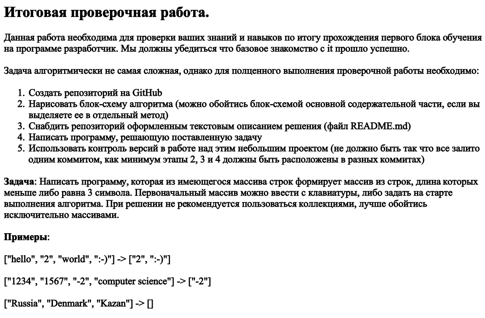
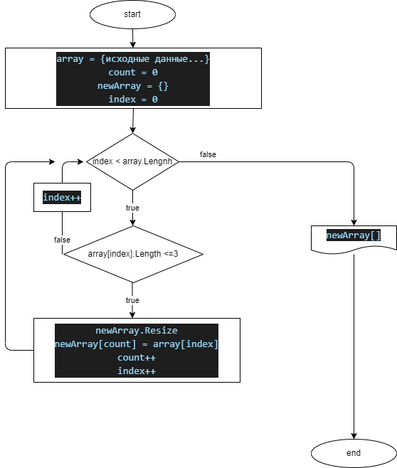

## описание алгоритма создания нового массива:

перед тем, как бежать по исходному массиву, инициализируем новый массив строк с нулевым размером

в цикле при обнаружении элемента исходного массива размером менее 4 символов - увеличиваем новый массив и добавляем туда элемент исходного

на выходе из функции возвращаем новый массив

